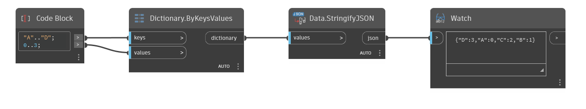

## In Depth
Data.StringifyJSON converts values to JSON format. JSON file format is a convention for structuring data you want to store. In fact, Dynamo's own file format is structured as JSON.
___
## Example File

