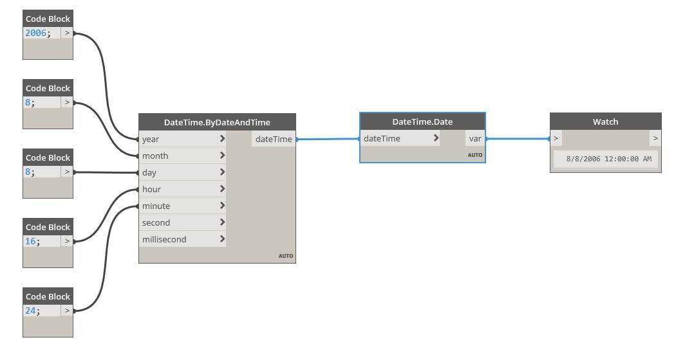

## In Depth
Date will return only the date (year, month, day) from a dateTime. In the example below, only the date, August 08 2006, is extracted from a dateTime, August 08, 2006 4:24PM.
___
## Example File

