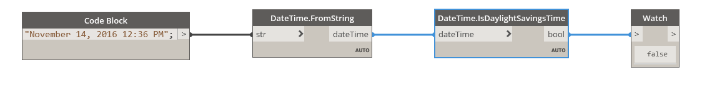

## In Depth
IsDaylightSavingsTime will return a boolean value based on whether the dateTime falls within Daylight Saving Time. In the example below, a dateTime of November 14, 2016 12:36PM returns false.
___
## Example File

