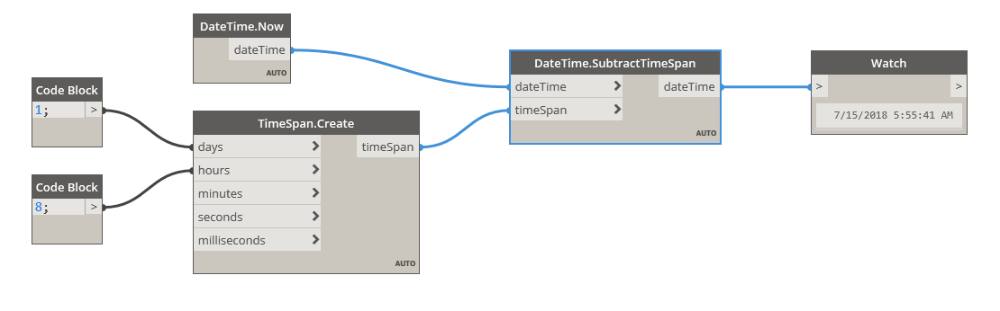

## In Depth
SubtractTimeSpan will return a new dateTime by subtracting a timeSpan from a dateTime. In the example below, a timeSpan of one day and eight hours is subtracted from a dateTime of Now, returning November 13, 2016 4:40AM.
___
## Example File

