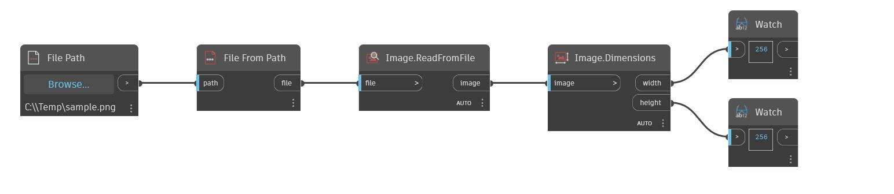

## In Depth
Dimensions will return the width and height of an input image in pixels. In the example below, we first use a File Path node and a File.FromPath to create a file object that points to an image. Image.ReadFromFile is then used to create an image object based on the file. A Dimensions node shows us that this image has a width and height of 270 pixels.
___
## Example File

