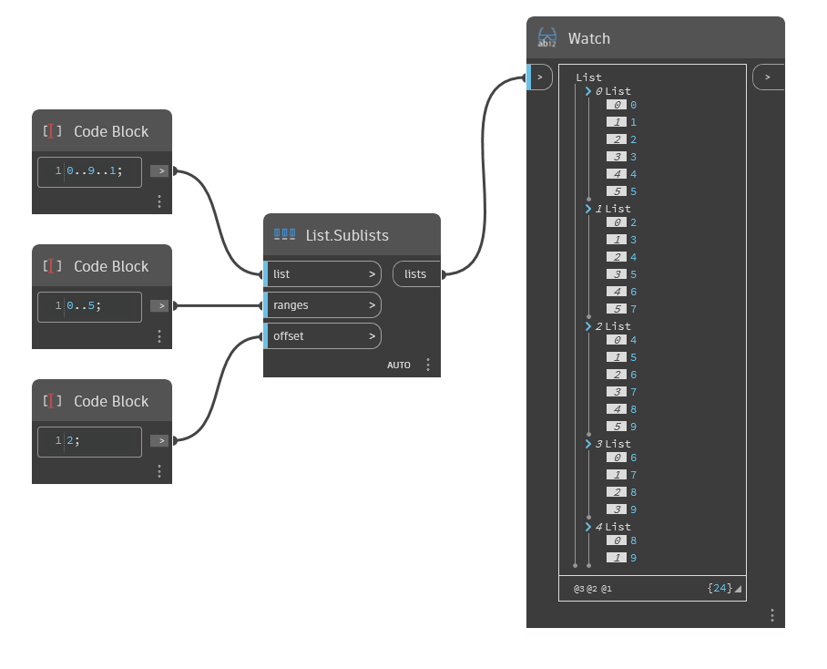

## In Depth
`List.Sublists` takes an input list and returns a series of sublists based on the input range and offset. The range determines which elements of the input list to put into the first sublist. The offset   determines where subsequent sublists begin, for example, an offset of 2 begins the next sublist at index 2, the following sublist at 4, and so on. This process repeats, increasing the range by the given offset until the resulting sublist is empty. 

The example below starts with a range of numbers from 0 to 9. The sublist range is 0 to 5, with an offset of 2. In the output of nested sublists, the first list contains the elements with indices in the range 0..5, and the second list contains the elements with indices 2..7. As this is repeated, the subsequent sublists get shorter as the end of the range becomes larger than the length of the initial list.

___
## Example File

