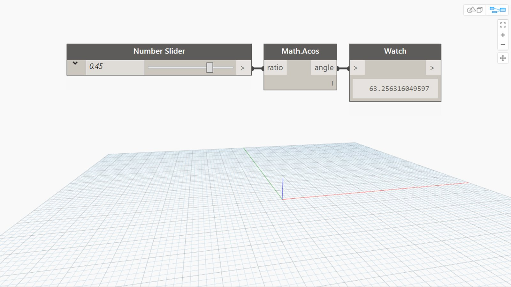

## In Depth
Acos will return the inverse cosine, also known as the ArcCosine, of an input number between -1 and 1. This output angle is returned in degrees. In the example below we use a number slider set to the range -1 to 1 to control the input to an Acos node.
___
## Example File

