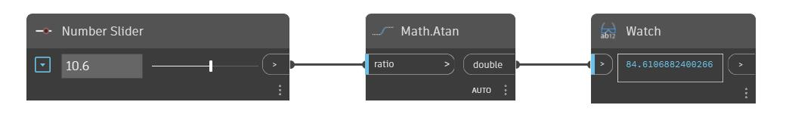

## In Depth
Atan will return the inverse sine, also known as the ArcTangent, of an input number. This output angle is returned in degrees. In the example below we use a number slider to control the input to an Atan node.
___
## Example File

