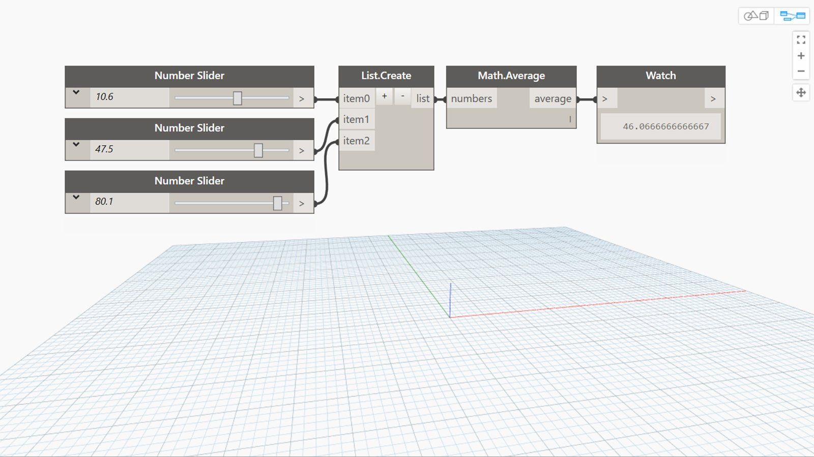

## In Depth
Average will return the average (arithmetic mean) of a list of numbers. In the example below, we first use three number sliders to create three numbers to find the average of. We then use a List.Create node combine these three numbers into a list that we can then use as the input for an Average node.
___
## Example File

