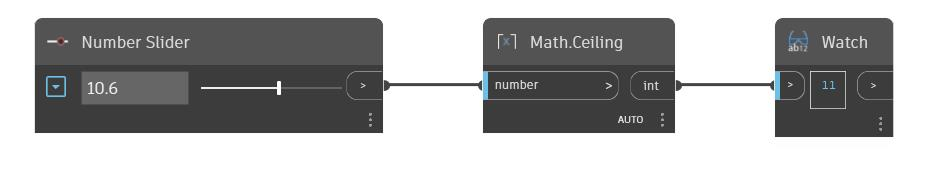

## In Depth
Ceiling will find the nearest integer that greater than an input number. This can also be thought of as rounding up to the nearest integer. In the example below, we use a number slider to control the input to a Ceiling node.
___
## Example File

