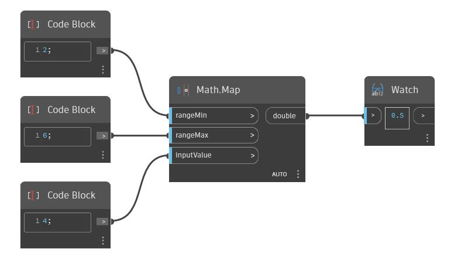

## In Depth
Map will return the position of a number in a range as a double. In the example below, a value of 4 is mapped to a range of 2 to 6. Since 4 is halfway between 2 and 6, a value of 0.5 is returned.
___
## Example File

