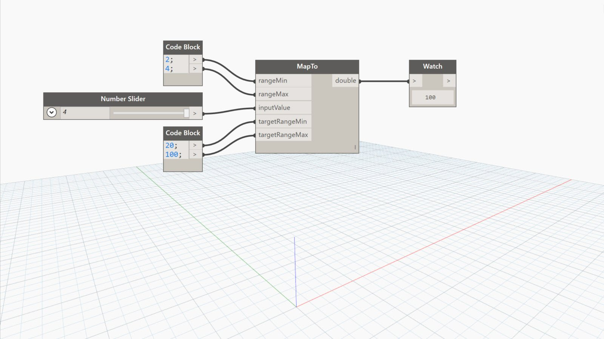

## In Depth
MapTo will get the position of a number in a range (similar to the Map node), then map that position to a target range. A number in the target range is returned based on the position value. In the example below, the number 3 returns a position of 0.5 between a range of 2 and 4. That position value of 0.5 in a target range of 20 to 100 returns the number 60.
___
## Example File

