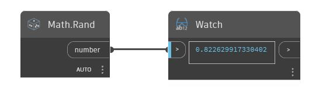

## In Depth
Rand will generate a random number in the range 0 to 1. Each instance of Rand will produce a different random number, but the number for a specific instance will remain constant.
___
## Example File

