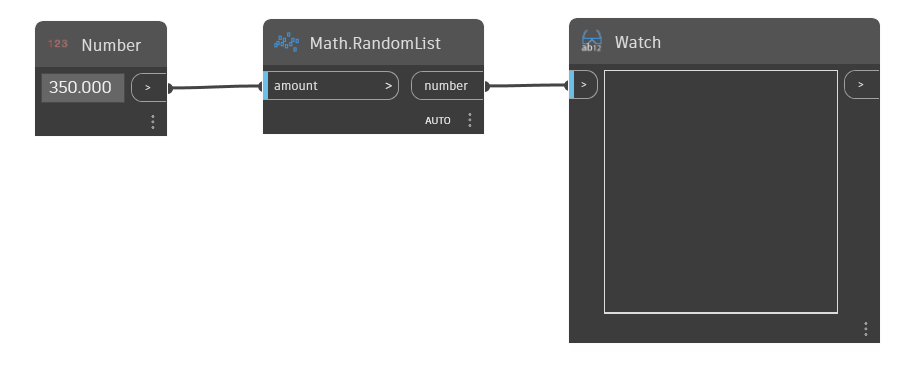

## In Depth
`Math.RandomList (amount)` produces the given amount of random numbers between 0 and 1. This node is commonly paired with a `Math.RemapRange` node to recreate the list within a new range of numbers while preserving the distribution ratio.

In the example below, an ‘amount’ input of 350 is used to generate 350 random numbers between 0 and 1. 
___
## Example File

