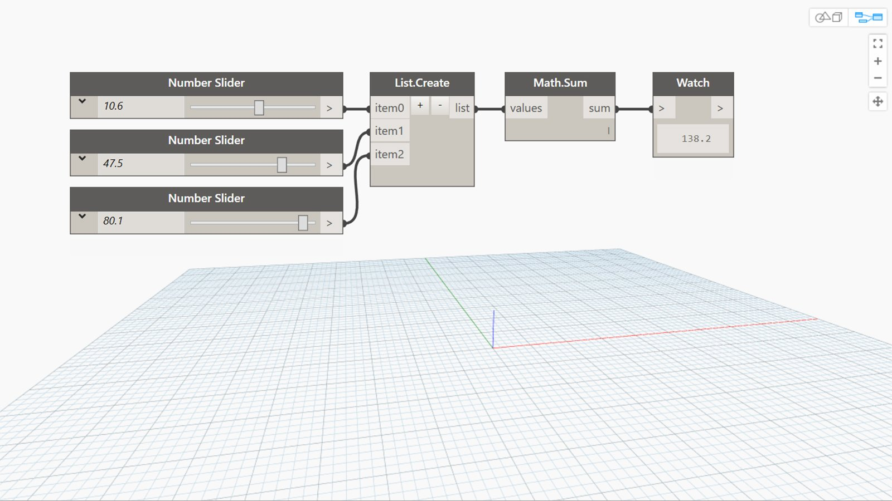

## In Depth
Sum will find the sum of the values of an input list. In the example below, we use three number sliders to create three numbers. We then use a List.Create node to combine them into a list that can be used as the input to a Sum node.
___
## Example File

