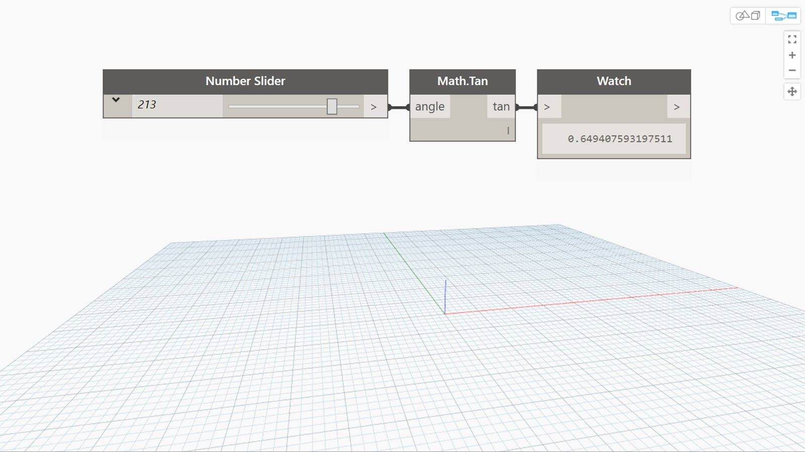

## In Depth
Tan will return the tangent of an input angle in degrees. In the example below, we use a number slider set to the range -360 to 360 to control the input angle to a Tan node.
___
## Example File

