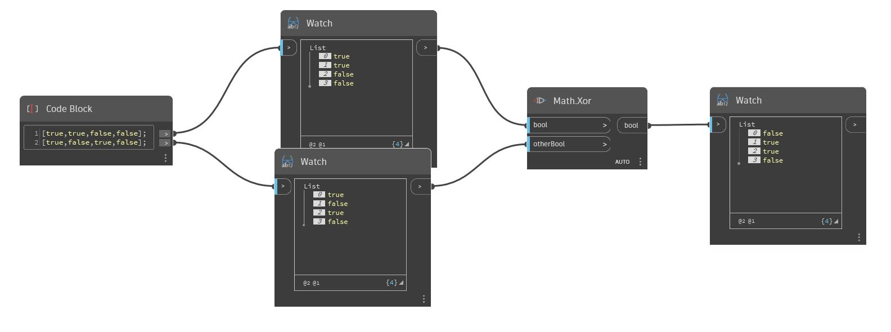

## In Depth
Xor will accept two boolean values, or two lists of boolean values and determines whether the values are the same or different. Xor compares two values and returns 'true' if exactly one of the inputs is 'true'. If both values are 'true' or if both values are 'false', Xor will return 'false'. In the example below, we start with two lists of boolean values. Together, these lists represent the four possible combinations of true and false values. Notice that unlike And and Or nodes, Xor only allows two values.
___
## Example File

