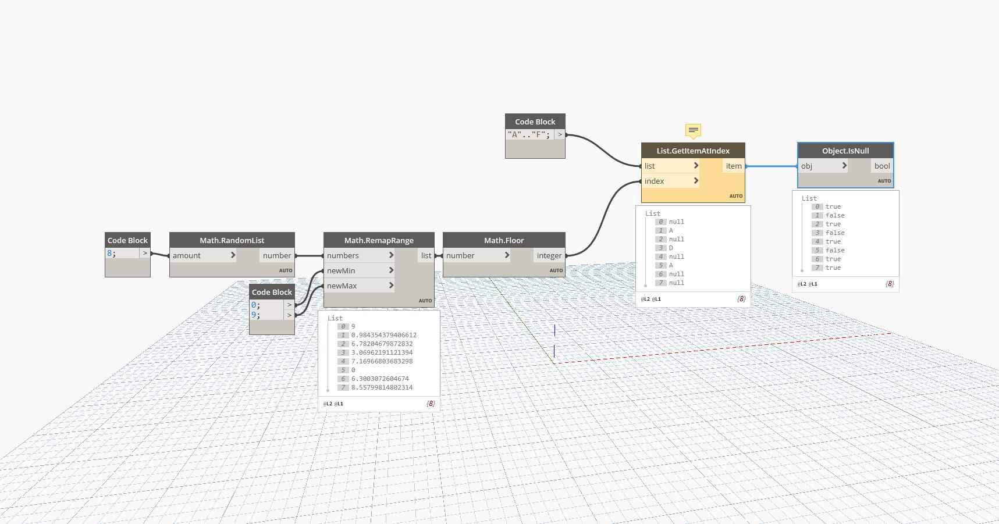

## In Depth
IsNull will return a boolean value based on whether an object is null. In the example below, a grid of circles is drawn with varying radii based on the Red level in a bitmap. Where there is no Red value, no circle is drawn and returns a null in the list of circles. Passing this list through IsNull returns a list of boolean values, with true representing every location of a null value. This list of booleans can be used with List.FilterByBoolMask to return a list without nulls.
___
## Example File

