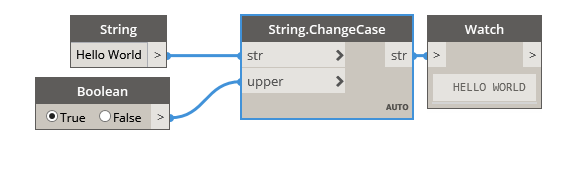

## In Depth
Change Case takes a string and a boolean value as input. If the boolean input is 'true', it will change the input string to upper case. If the boolean input is false, it will change the input string to lower case. In the example below, we use an example string 'Hello World' as the input string, and a boolean toggle to specify whether to change the string to all upper case or all lower case letters.
___
## Example File

