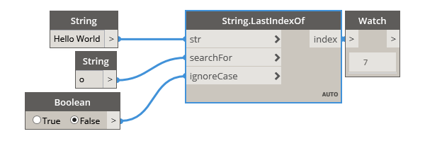

## In Depth
Last Index Of will search a given string for a second input string. If the second string is found, this node will return the index of the last occurrence. By default this node is case sensitive. A boolean value can be used in the 'ignoreCase' input to make the node ignore the case of the strings. In the example below, we use the string 'Hello World', and search for the string 'o'. This string is found twice within the base string, and the index of the final occurrence of the string is returned.
___
## Example File

