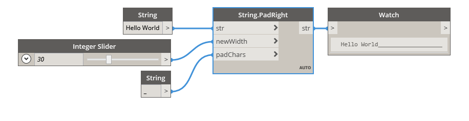

## In Depth
PadRight will increase the width of an input string according to the newWidth input by adding the padChars input on the right side of the original string. If the original string is longer than the newWidth input, this node will return the original string unchanged. In the example below, we use the string 'Hello World' as the input string. A string with an underscore character is used as the padding character, while an integer slider is used to control the new width of the string.
___
## Example File

