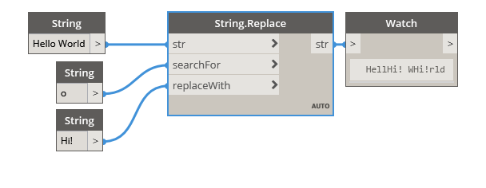

## In Depth
Replace will search a given string for a second input string. If that string is found, it will be replaced by a third input string. This node is case sensitive. In the example below, we start with the string 'Hello World'. The string 'o' is used as the string to search for, and a third string 'Hi!' is input as the string to replace with. Because the letter 'o' occurs twice within the original string, it is replaced in both occurrence with the string 'Hi!'.
___
## Example File

