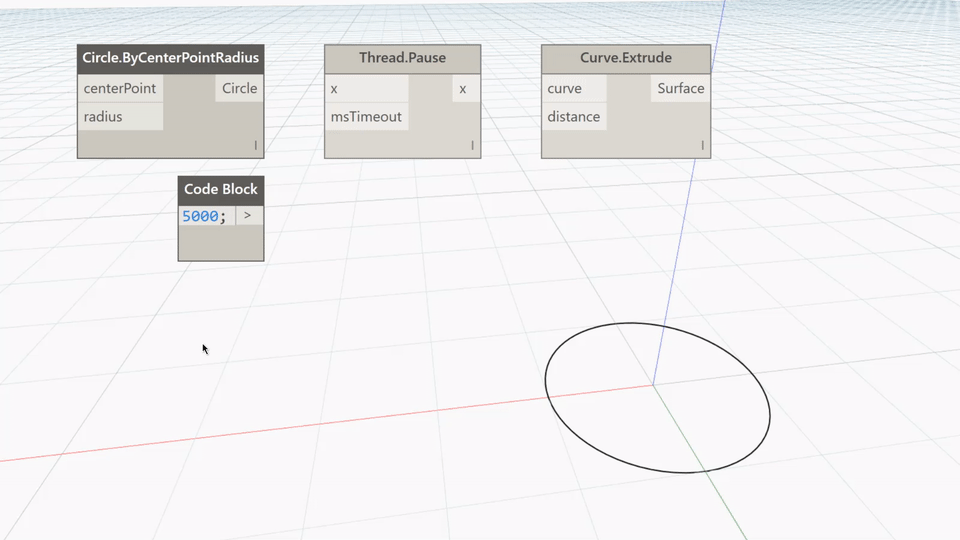

## In Depth
Pause will return the result of a node after pausing the thread for a specified amount of time. In the example below, a circle is extruded into a surface 5 seconds after the thread is run. To use the time delay, the program should be run in Manual.
___
## Example File

