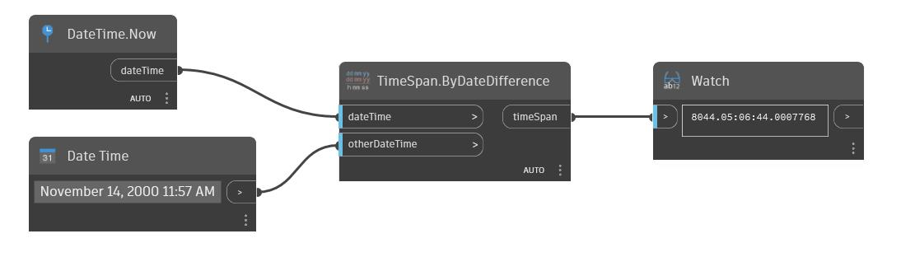

## In Depth
ByDateDifference will return the difference of two DateTimes as a new TimeSpan. In the example below, the difference between Now and November 14, 2000 11:57AM was returned as 5844 Days, and roughly 4 Seconds.
___
## Example File

