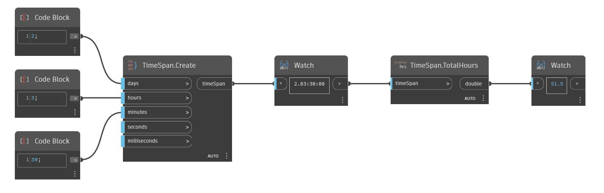

## In Depth
TotalHours will return the number of hours in a TimeSpan as a double. In the example below, the total number of hours returned from the TimeSpan 2.03:00:00 is 51.5.
___
## Example File

