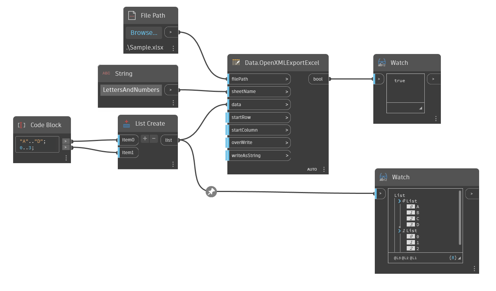

## In Depth
Data.OpenXMLExportExcel writes data to Microsoft Excel using the OpenXML standard. This version of Excel nodes does not require Excel to be installed on the machine. overWrite and writeAsString are optional inputs with default values. Overwrite will replace all content in an excel file and writeAsString will force all data to a string representation.
___
## Example File

