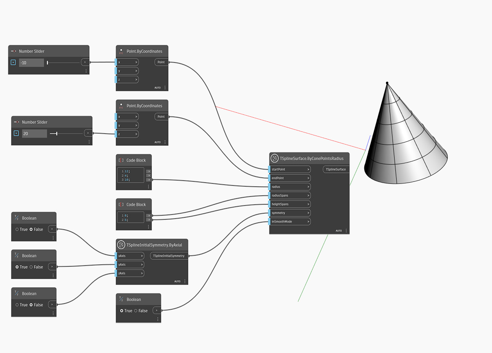

## In-Depth
In the example below, a T-Spline cone primitive is created using `TSplineSurface.ByConePointsRadius` node. The position and height of the cone is controlled by the two inputs of `startPoint` and `endPoint`. Only the base radius can be adjusted with the `radius` input, and the upper radius is always zero. `radialSpans` and `heightSpans` determine the radial and height spans. The initial symmetry of the shape is specified by the `symmetry` input. If X or Y symmetry is set to True, the value of radial spans must be a multiple of 4. Finally, the `inSmoothMode` input is used to switch between smooth and box mode preview of the T-Spline surface.

## Example File

