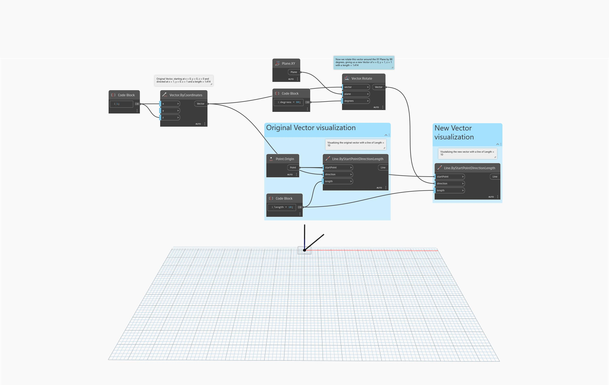

<!--- Autodesk.DesignScript.Geometry.Vector.Rotate(vector, plane, degrees) --->
<!--- KIWQMTKYTV555M5VBMXQPP5T2SOWPLBC5NHE2QXRVMJY5EJJY7BA --->
## In Depth
`Vector.Rotate (vector, plane, degrees)` rotates a vector around the plane origin and normal by a specified degree.

In the example below, a vector is rotated around the XY plane by 90 degrees and visualized with a line.
___
## Example File

