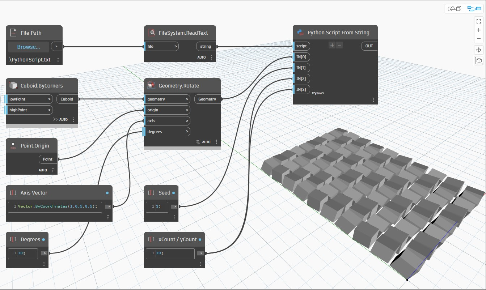

## In Depth
Python Script From String will return the result of the node's inputs passed through a string Python script. In the example below, a Python script is retrieved from a text file and converted into a string. A cube created from Cuboid.ByCorners is arrayed and translated by the Python script by looping through both X and Y.
___
## Example File

