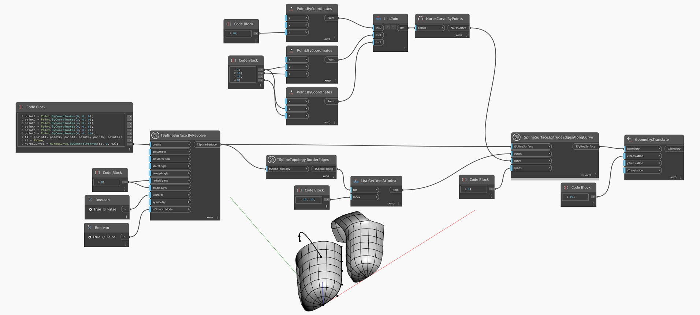

<!--- Autodesk.DesignScript.Geometry.TSpline.TSplineSurface.ExtrudeEdgesAlongCurve --->
<!--- RJA3JYUP36W2AR37ZYMWTK2ZDSFS6YXA5LMXE5CAYOZZDO6754CQ --->
## In Depth
In the example below, a set of border edges of a T-Spline surface is selected and used as input for the `TSplineSurface.ExtrudeEdgesAlongCurve` node. The result is translated to the side for better preview. 
___
## Example File

