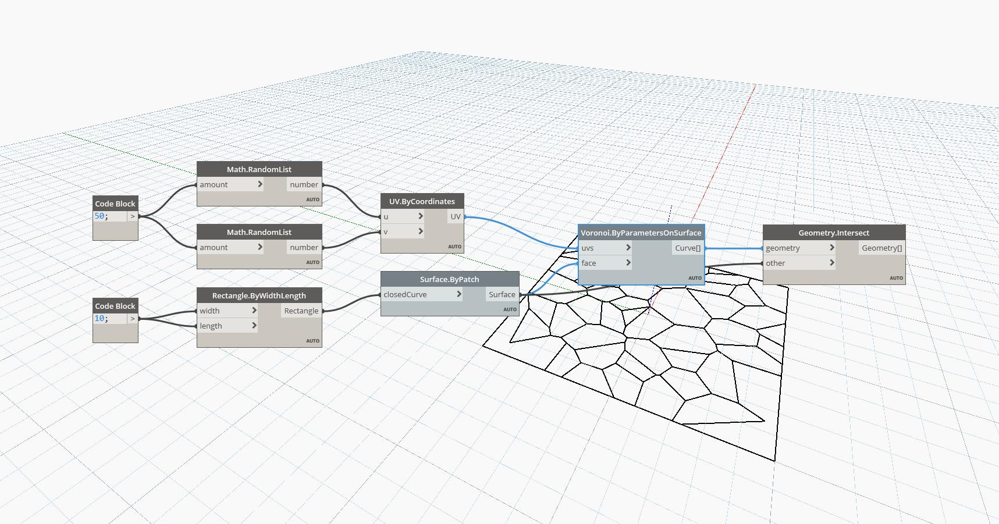

## In Depth
ByParametersOnSurface will return a Voronoi representation of a surface's UV as a list of curves. In the example below, a Voronoi representation is created on a surface using a UV system of 50 random values. In order for the Voronoi to stop at the edges of the surface, the returned curves must be intersected with the surface.
___
## Example File

