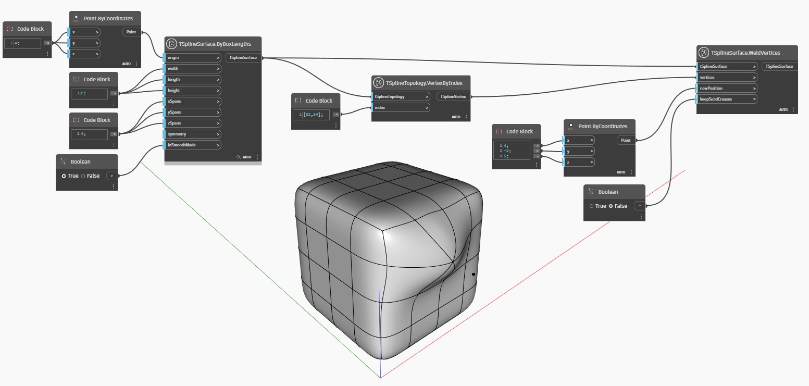

## In Depth
In the example below, two vertices of a T-Spline box surface are joined using `TSplineSurface.WeldVertices` node. A new position for the welded vertices is provided as `newPosition` input. Additionally, the `keepSubdCreases` input controls whether the edges along the weld are creased.

___
## Example File

