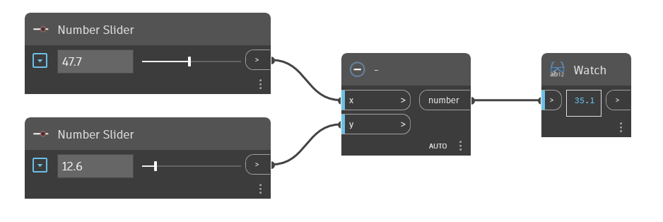

## Podrobnosti
Uzel `-` je operátor odčítání. Vrací výsledek vstupu `y` odečtený od vstupu `x`.

V níže uvedeném příkladu se pomocí uzlu - odečte vstup `y` od vstupu `x`. K řízení vstupů operátoru `-` použijeme dva číselné posuvníky.
___
## Vzorový soubor

