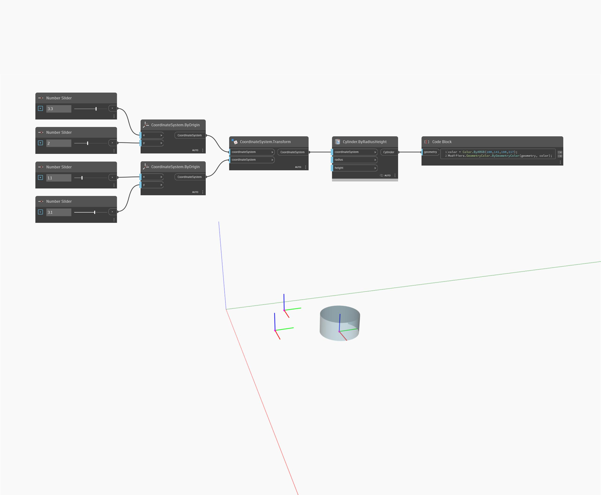

<!--- Autodesk.DesignScript.Geometry.CoordinateSystem.Transform(coordinateSystem, fromCoordinateSystem, contextCoordinateSystem) --->
<!--- 43XHCR2GSF5A34R3G2P7OGOWDWYKS3WCXART33FSES5M5ZF2MHJA --->
## Podrobnosti
Metoda CoordinateSystem.Transform transformuje daný souřadnicový systém ze zdrojového souřadnicového systému na nový souřadnicový systém.
___
## Vzorový soubor

