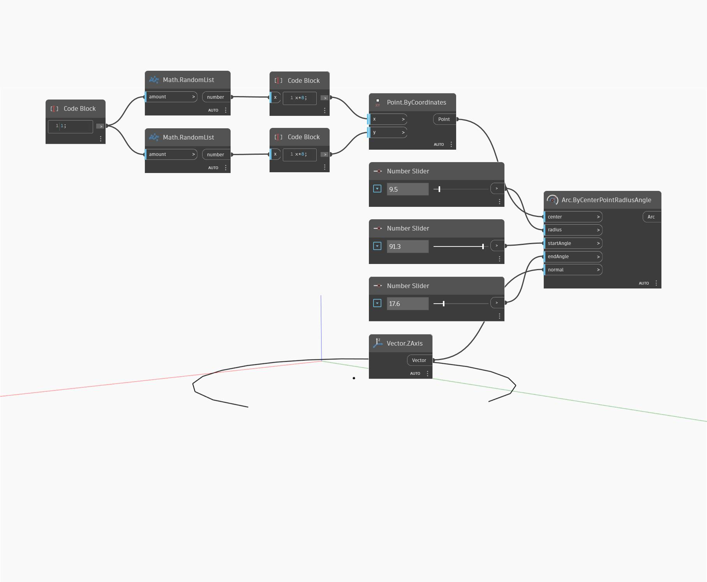

## Podrobnosti
Metoda Arc ByCenterPointRadiusAngle kreslí oblouk relativně ke svému středu a kolmému směru. Zadáním počátečního a koncového úhlu v podstatě kreslíte část kružnice. V tomto příkladu je v rovině XY vygenerován náhodný bod a kolem něj se vytvoří oblouk.
___
## Vzorový soubor

