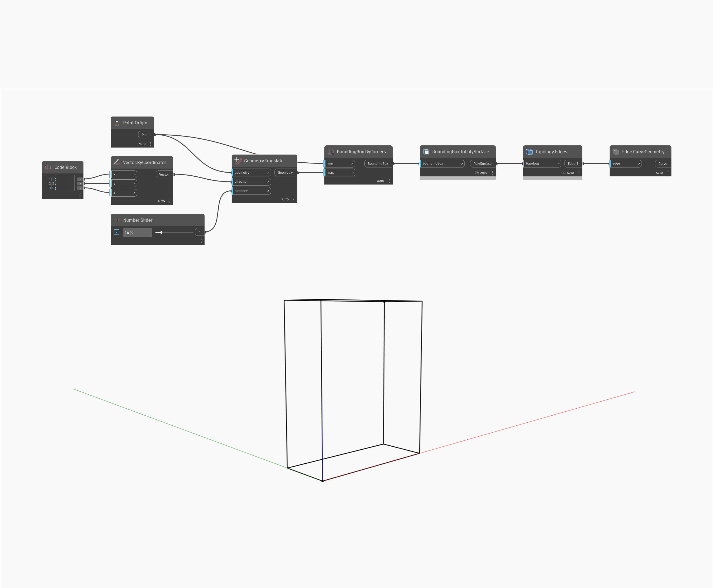

## Podrobnosti
Uzel `BoundingBox.ByCorner` vytvoří objekt BoundingBox ze dvou vstupních bodů.

V následujícím příkladu použijeme diagonální vektor k posunutí počátečního bodu kvádru a vytvoření jeho koncového bodu. Při vizualizaci kvádru je kvádr převeden na objekt PolySurface a křivky jeho hran jsou extrahovány.

___
## Vzorový soubor

