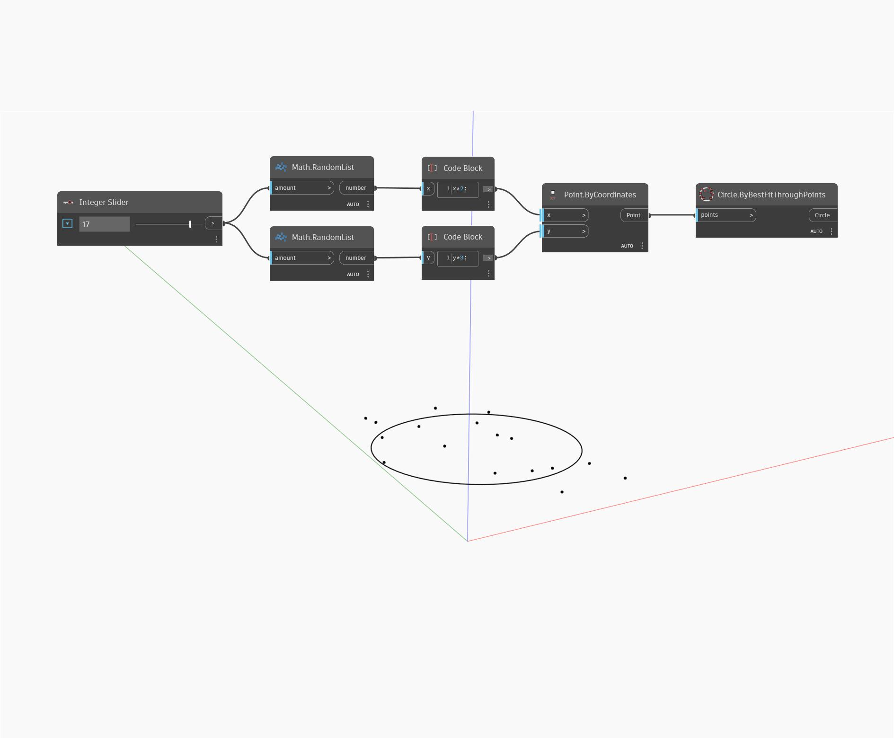

## Podrobnosti
Uzel `Circle.ByBestFitThroughPoints` přijímá vstupy bodů a vytváří přes ně nejlépe proloženou kružnici.

V níže uvedeném příkladu je seznam náhodně generovaných bodů použit ke generování kružnice, která je nejlépe aproximuje. Počet bodů lze dynamicky zvýšit a snížit pomocí posuvníku, čímž se změní tvar výsledné kružnice.

___
## Vzorový soubor

