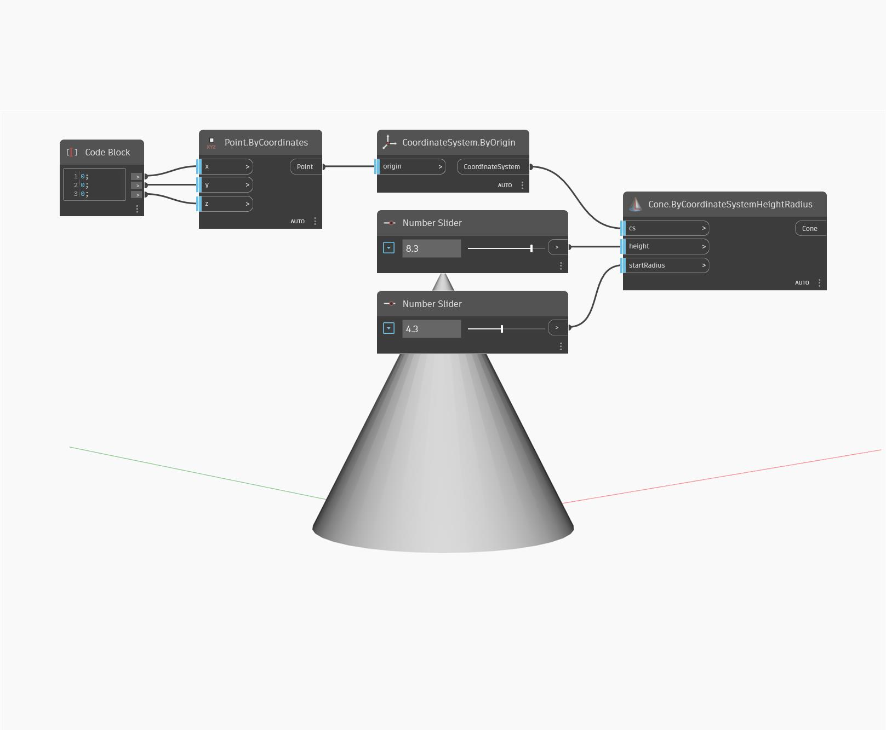

## Podrobnosti
Metoda Cone ByCoordinateSystemHeightRadius vytvoří geometrii kuželu z poloměru, počátku kuželu a hodnoty výšky. Tento příklad ukazuje dynamický kužel kolem globálního počátku vytvořený pomocí dvou číselných posuvníků.
___
## Vzorový soubor

