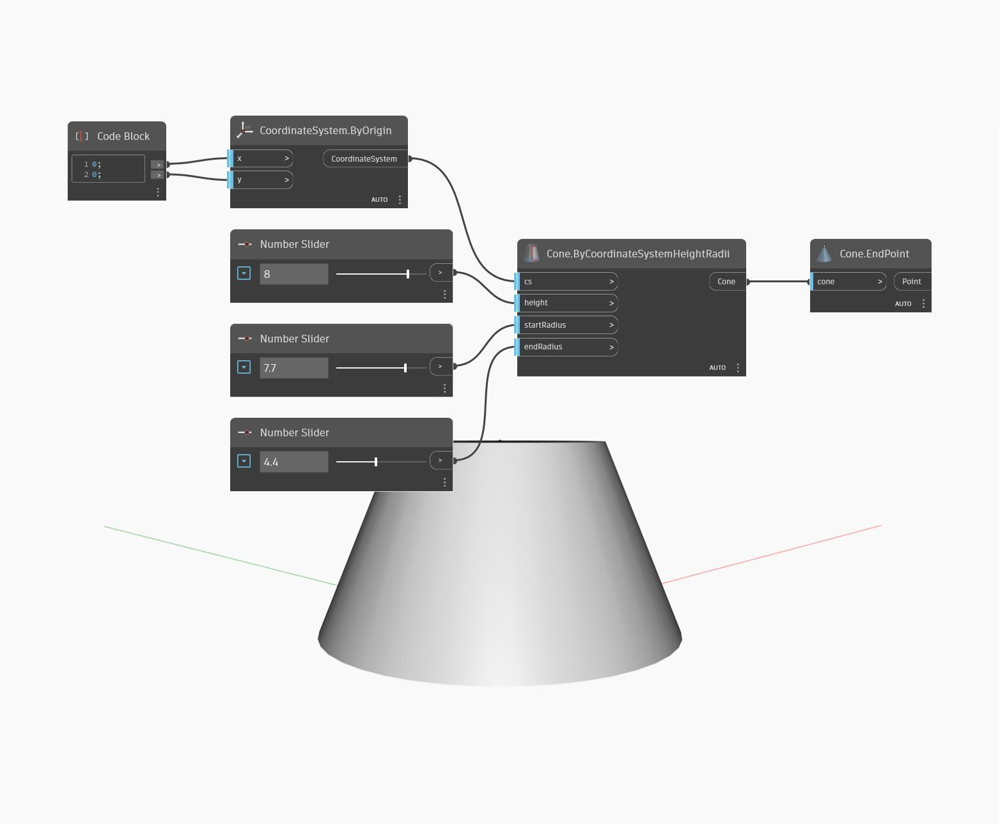

## Podrobnosti
Uzel `Cone.EndPoint` vrací vrchol kužele nebo střed horní kružnice oříznutého kužele.

V následujícím příkladu vytvoříme kužel určením souřadnicového systému a dvou poloměrů. Poté pomocí možnosti `Cone.EndPoint` vyhledáme střed horní kružnice kužele.

___
## Vzorový soubor

