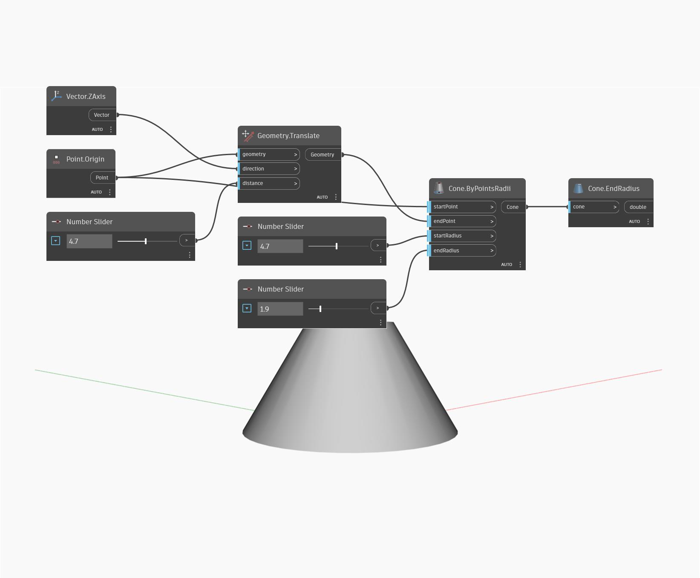

## Podrobnosti
Uzel End Radius najde poloměr horní kružnice oříznutého kuželu. V níže uvedeném příkladu vytvoříme kužel určením počátečního a koncového bodu a také počátečního a koncového poloměru. Poté bude možné z kuželu extrahovat koncový poloměr.
___
## Vzorový soubor

