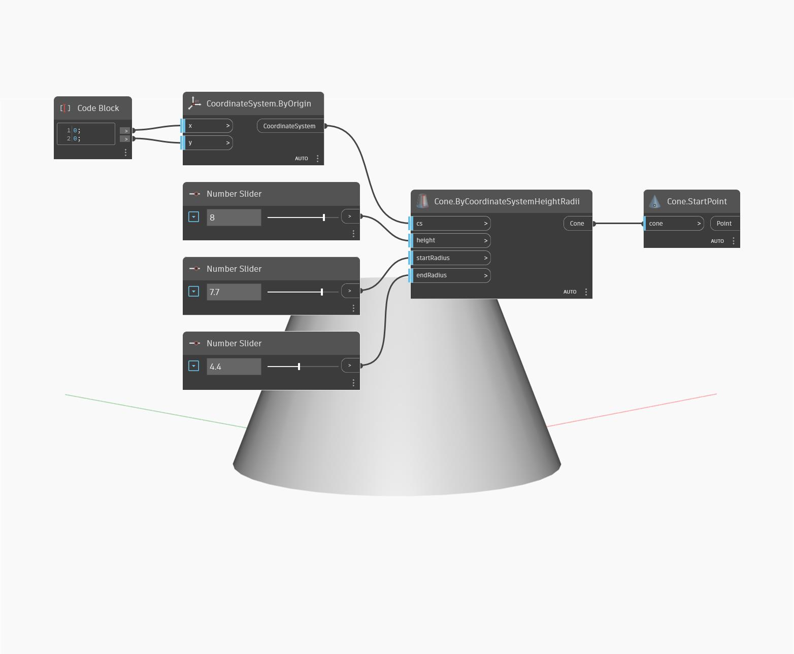

## Podrobnosti
Uzel `Cone.StartPoint`vyhledává střed základny kužele.

V následujícím příkladu vytvoříme kužel určením souřadnicového systému a dvou poloměrů. Poté pomocí uzlu `Cone.StartPoint` vyhledáme střed dolní kružnice kužele.

___
## Vzorový soubor

