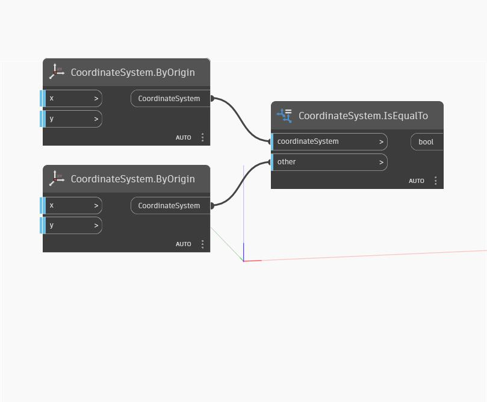

## In Depth
IsEqualTo will return a boolean value based on whether the values of the input CoordinateSystems are equal to each other. In the example below, two CoordinateSystems with identical, positive and negative origin positions are passed through IsEqualTo, returning a false boolean value. However, inverting the positive CoordinateSystem returns a true boolean value from IsEqualTo because it's origin point X and Y values are now negative.
___
## Example File

