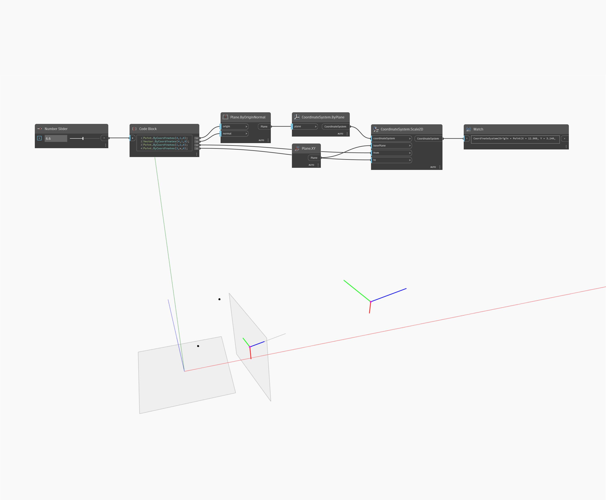

## Podrobnosti
Uzel Geometry Scale2D změní měřítko geometrie ve dvou směrech od základní roviny a dvou referenčních bodů. V ukázkovém souboru je měřítko kuželu změněno od koncového bodu po jeho těžiště vzhledem k rovině YZ.
___
## Vzorový soubor

