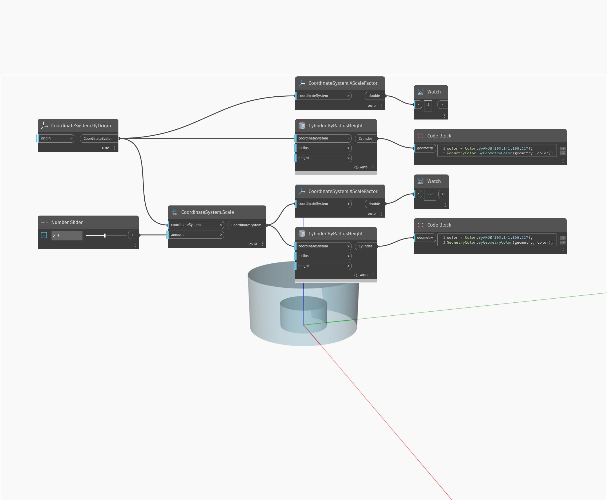

## Podrobnosti
Uzel XScaleFactor vrátí hodnotu typu double představující faktor měřítka podél osy X. V níže uvedeném příkladu je měřítko válce změněno na 2.3, čímž se vrátí hodnota faktor měřítka 2.3 v ose X.
___
## Vzorový soubor

