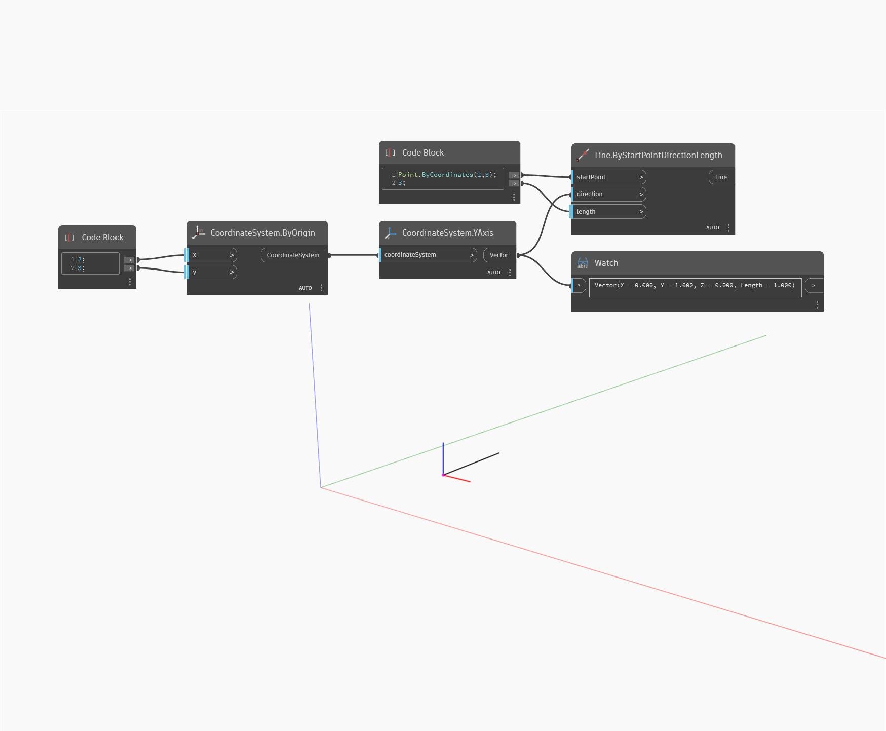

## Podrobnosti
Uzel YAxis vrátí vektor, který představuje osu Y objektu WorldCoordinateSystem. V níže uvedeném příkladu se pomocí vráceného vektoru vytvoří úsečka, která následuje osu Y v GSS.
___
## Vzorový soubor

