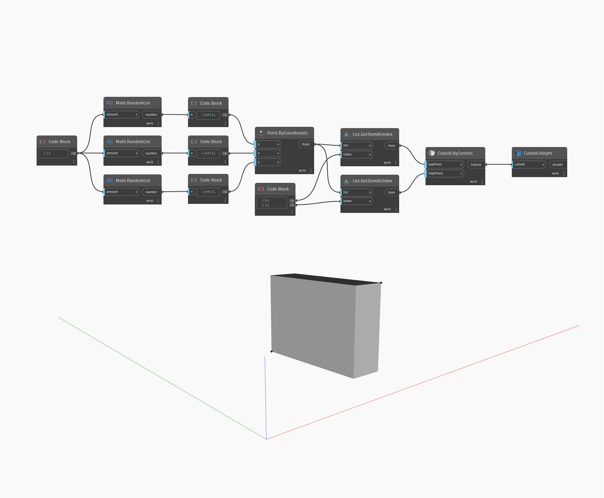

## Podrobnosti
Uzel `Cuboid.Height` vrací výšku vstupního kvádru. Všimněte si, že pokud byl kvádr transformován do jiného souřadnicového systému s měřítkem, vrátí se původní rozměry kvádru, nikoli rozměry v rámci reálného prostoru. Jinými slovy, pokud vytvoříte kvádr s šířkou 10 (v ose X) a transformujete ho do souřadnicového systému s 2násobným měřítkem v ose X, šířka bude stále 10.

V následujícím příkladu vygenerujeme kvádr pomocí rohů a poté pomocí uzlu `Cuboid.Height` zjistíme jeho výšku.

___
## Vzorový soubor

