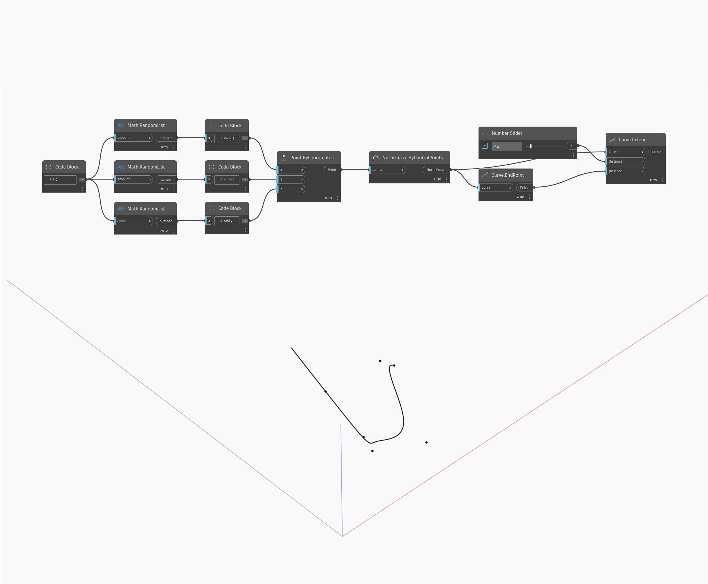

## Podrobnosti
Uzel Extend prodlouží vstupní křivku o zadanou vstupní vzdálenost. Vstup pickSide přijímá počáteční nebo koncový bod křivky a určuje, který konec křivky se má prodloužit. V níže uvedeném příkladu nejprve vytvoříme křivku Nurbs pomocí uzlu ByControlPoints, přičemž jako vstup se použije sada náhodně generovaných bodů. Pomocí uzlu dotazu Curve.EndPoint najdeme koncový bod křivky, který se použije jako vstup `pickSide`. Číselný posuvník umožňuje řídit vzdálenost prodloužení.
___
## Vzorový soubor

