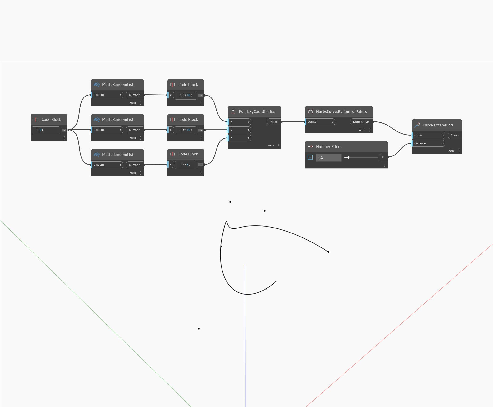

## Podrobnosti
Uzel Extend End prodlouží vstupní křivku o zadanou vstupní vzdálenost počínaje koncovým bodem křivky. V níže uvedeném příkladu nejprve vytvoříme křivku Nurbs pomocí uzlu ByControlPoints, přičemž jako vstup se použije sada náhodně generovaných bodů. Číselný posuvník umožňuje řídit vzdálenost prodloužení.
___
## Vzorový soubor

