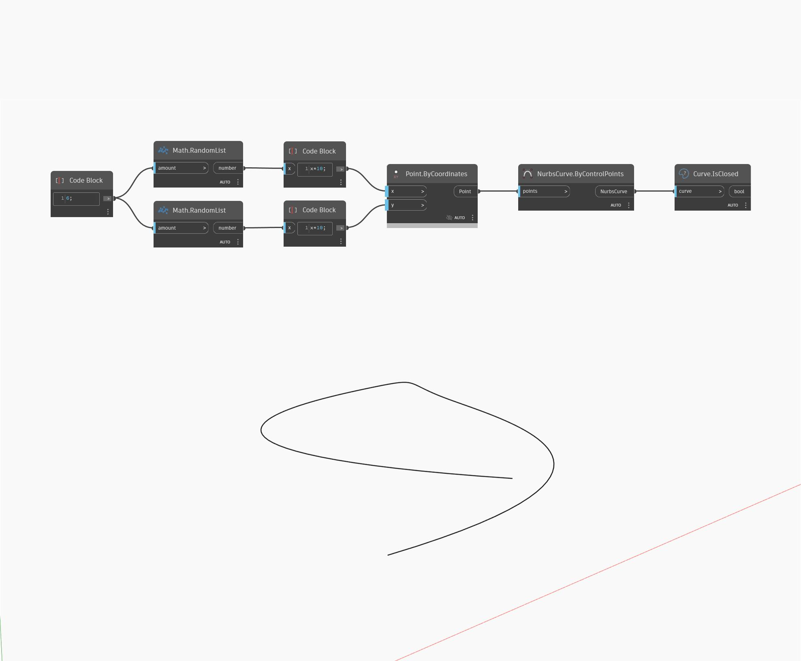

## Podrobnosti
Uzel Is Closed vrátí booleovskou hodnotu, která vyjadřuje, zda je vstupní křivka uzavřená, či nikoli. V níže uvedeném příkladu nejprve vytvoříme křivku Nurbs pomocí uzlu ByControlPoints, přičemž jako vstup se použije sada náhodně generovaných bodů. Poté můžeme vyzkoušet, zda je tato křivka uzavřená, pomocí uzlu IsClosed.
___
## Vzorový soubor

