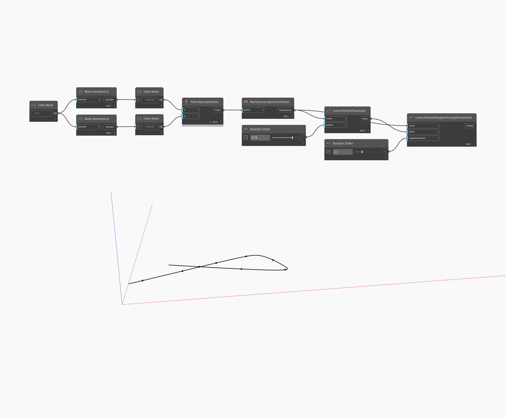

## Podrobnosti
Uzel Points At Segment Length From Point vrátí seznam bodů podél křivky naměřených postupně podle vstupní délky segmentu od určeného bodu podél křivky. V níže uvedeném příkladu nejprve vytvoříme křivku Nurbs pomocí uzlu ByControlPoints, přičemž jako vstup se použije sada náhodně generovaných bodů. Pomocí uzlu PointAtParameter a číselného posuvníku nastaveného na rozsah 0 až 1 určíme počáteční bod podél křivky pro uzel PointsAtSegmentLengthFromPoint. Nakonec pomocí druhého číselného posuvníku upravíme použitou délku segmentu křivky.
___
## Vzorový soubor

